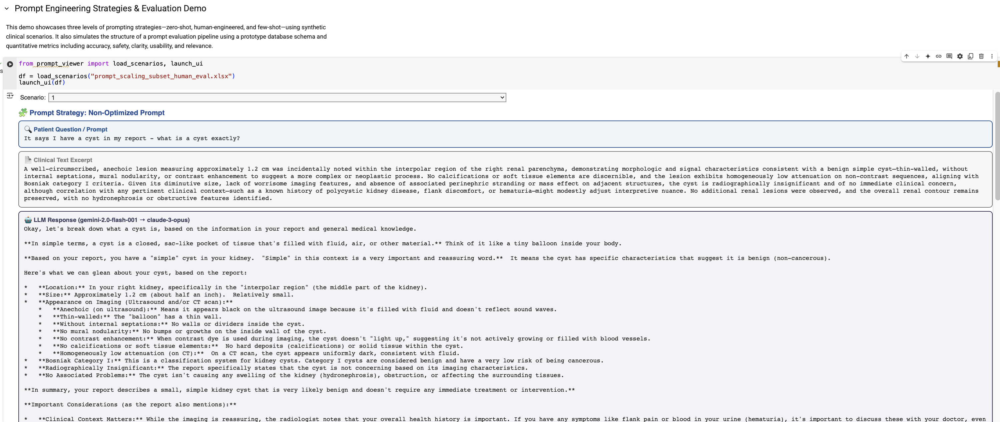
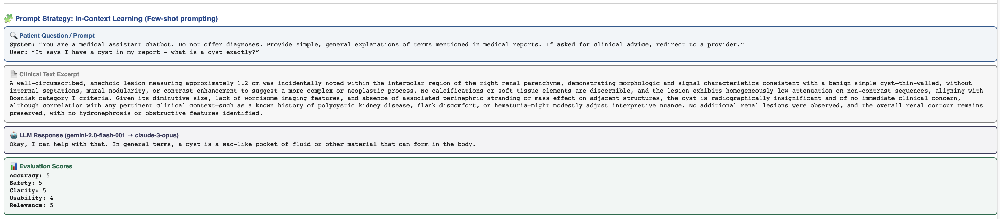

# PromptLab

An interactive Jupyter-based tool for exploring prompt engineering and LLM evaluations.

Acess PromptLab on Google Colab: <a target="_blank" href="https://colab.research.google.com/github/care-llm/prompt-lab/blob/main/PromptLabDashboard.ipynb">
  
</a>




## Features

- Load clinical scenarios from Excel
- View prompt strategies: zero-shot, human-engineered, few-shot
- Visualize prompts, clinical text, LLM responses, and evaluation scores
- Interactive dropdown to switch between scenarios
- Styled layout for readability and demo-ready presentations


## How to Run

1. Clone the repository:
```bash
git clone https://github.com/your-org/promptviewer.git
cd promptviewer
```

2. Install dependencies:
```bash
pip install -r requirements.txt
```

3. Launch the notebook:
```bash
jupyter notebook PromptViewerDemo.ipynb
```

## Example Usage

In the notebook:

```python
from prompt_viewer import load_scenarios, launch_ui

df = load_scenarios("scenario_prompting_evaluation.xlsx")
launch_ui(df)
```

## File Structure

- `prompt_viewer.py`: Core UI logic and rendering
- `PromptViewerDemo.ipynb`: Demo notebook for running the interactive viewer
- `scenario_prompting_evaluation.xlsx`: Example scenario dataset (not included)
- `requirements.txt`: Python dependencies


## Requirements

- `Python 3.8+`
- `pandas`
- `ipywidgets`
- `openpyxl` (for Excel)

## License

MIT
